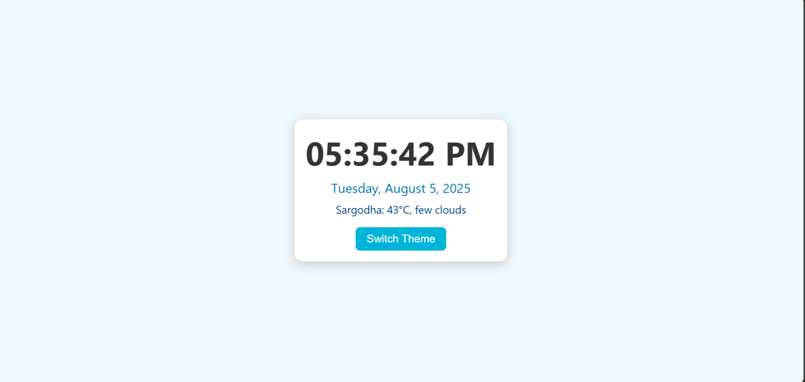

# Digital Clock 

A simple and beautiful digital clock with theme switcher and live weather.

## 🔥 Live Preview
[Click here to view](https://emanqamar17.github.io/digital-clock)

## 📷 Screenshot

## 💡 Features
- Live Digital Time (HH:MM:SS AM/PM)
- Date display
- Theme switcher (Light/Dark)
- Mobile responsive
- Weather feature (uses OpenWeather API)

## 🛠 Technologies Used
- HTML
- CSS
- JavaScript

## 🌐 How to Use
1. Clone or download the repository
2. Open `index.html` in a browser
